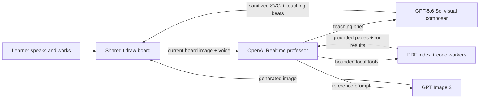

# Trace

**A voice-first professor that can see your work.**

Trace replaces the chat box with a shared infinite whiteboard. Speak naturally while you sketch, drop in a textbook, or edit runnable code. The professor sees the same board, teaches visually, and points to the exact thing it is explaining.

Built for the **Education** track of [OpenAI Build Week](https://openai.devpost.com/).

## Why Trace

Most AI tutors turn learning into question-and-answer chat. Real teaching is more spatial and collaborative: a professor watches how you approach a problem, draws when words are not enough, follows your work across a board, and lets you struggle productively.

Trace makes the whiteboard—not a transcript—the center of the lesson.

## One-minute judge path

1. Click **Start a conversation** and allow microphone access.
2. Say: “Teach me gradient descent visually, then ask me to predict the next step.”
3. Interrupt the professor or draw on the board; it sees the updated canvas on the next turn.
4. Drop a PDF onto the board and ask for a page-grounded quiz.
5. Add a code cell, edit it, run it, and ask the professor to explain the result.
6. Say: “Make my Learning Trace from what I actually demonstrated.”

## What works

- OpenAI Realtime voice over WebRTC with semantic turn detection, interruption, and mute
- A fresh board image attached to every spoken turn, so the professor sees sketches and dropped content
- GPT‑5.6 Sol visual reasoning that composes a board-aware SVG plus ordered teaching beats
- Animated pointing, circling, and underlining synchronized with the spoken explanation
- GPT Image 2 generation for visual references where SVG is the wrong medium
- Local PDF rendering and text indexing, with tools to list, search, and read bounded page ranges
- “Show me the source” navigation that opens the exact cited PDF page and focuses it on the board
- Evidence-based Learning Traces with demonstrated understanding, revised misconceptions, and a next challenge
- Borderless “living code ink” that runs Python, JavaScript, C17, or C++20 directly on the board
- Prediction → observation comparisons pinned beside code before the professor explains the result
- Consent-based Misconception Trails that preserve original model, turning evidence, and revised understanding
- Multiple tutoring sessions with isolated boards, local transcript storage, and SQLite FTS5 search
- Native drag-and-drop for images, SVG, files, URLs, and text
- Responsive UI, keyboard focus states, reduced-motion support, and a first-run guide

## Build Week extension

This repository began as a Create Next App shell before the submission period. The meaningful Build Week implementation was created with Codex and includes:

- the complete voice-first tutoring product and interaction design
- the OpenAI Realtime agent and its board, document, image, gesture, and code tools
- the GPT‑5.6 Sol structured visual-composition pipeline
- local-first PDF intelligence and session memory
- sandboxed, in-board multi-language code execution
- safety identifiers, bounded inputs, SVG sanitization, timeouts, and output caps
- the onboarding experience, offline-reliable build, architecture docs, and submission materials

The initial commit is the untouched framework scaffold; the Build Week commit history provides a clear before/after boundary for judging.

## OpenAI architecture



The Realtime agent runs in the browser because its tools operate on local whiteboard state. Before each response, Trace exports the current board and adds it to the conversation as image context. Privileged model calls remain server-side.

For designed explanations, the Realtime model supplies the teaching intent while a dedicated GPT‑5.6 Sol Responses API call sees the existing board and returns strict structured output: an original SVG and 2–6 ordered focal points. The SVG is sanitized through tldraw’s external-content pipeline before it becomes an editable canvas object.

PDF bytes, rendered pages, and extracted text remain in IndexedDB. Only bounded text returned by an explicit document tool becomes conversation context. Session metadata and transcripts live in `.data/trace.sqlite`; each canvas uses its own tldraw persistence key.

## Run locally

Requirements: Node.js 22+, an OpenAI API key, and a modern browser with microphone support.

```bash
npm install
cp .env.example .env.local
npm run local
```

Open [http://localhost:3000](http://localhost:3000), then add this server-only value to `.env.local`:

```bash
OPENAI_API_KEY=sk-proj-...
```

The browser never receives the long-lived key. `POST /api/realtime/token` exchanges it for a short-lived Realtime client secret.

For development, use `npm run dev:clean`. Development writes to `.next-dev`; production builds write to `.next`, avoiding stale output collisions.

## Environment

| Variable | Required | Purpose |
| --- | --- | --- |
| `OPENAI_API_KEY` | Yes for AI features | Realtime client secrets, GPT‑5.6 visuals, and GPT Image 2 |
| `NEXT_PUBLIC_TLDRAW_LICENSE_KEY` | For licensed production use | Applies your tldraw SDK license |
| `TRACE_DATABASE_PATH` | No | Overrides the local SQLite path |
| `TRACE_C_COMPILER` / `TRACE_CPP_COMPILER` | No | Overrides the local Clang paths |

Microphone access works on localhost. Production deployments require HTTPS.

## Code execution and safety

- JavaScript runs in a fresh Web Worker and captures console output in the cell.
- Python runs in a fresh worker using pinned Pyodide `0.28.3`.
- C17 and C++20 run locally through Clang and the macOS sandbox with network access denied.
- Workers and native processes are terminated after each run and outputs are capped.
- Model inputs are bounded; API calls carry pseudonymous hashed safety identifiers.
- Model-produced SVG is treated as untrusted external content and sanitized before import.

Native code execution is intended for a trusted local learning environment, not untrusted multi-tenant hosting.

## Verification

```bash
npm run lint
npm run typecheck
npm run build
```

## Demo video outline (under 3 minutes)

- **0:00–0:20 — Problem:** chat tutors cannot follow the learner’s spatial work.
- **0:20–1:05 — Voice + vision:** ask a concept question, draw, interrupt, and show the professor adapting.
- **1:05–1:40 — Visual teaching:** generate a GPT‑5.6 explanation and show synchronized gestures.
- **1:40–2:08 — Grounding:** drop a PDF, ask a question, then say “show me the source.”
- **2:08–2:28 — Active practice:** edit and run an in-board code cell.
- **2:28–2:45 — Evidence:** generate a Learning Trace from what the learner demonstrated.
- **2:45–2:57 — Build:** name Codex, GPT‑5.6 Sol, Realtime, local-first data, and safety boundaries.
- **2:57–3:00 — Close:** “Trace turns an AI tutor into someone who can actually work beside you.”

## Licensing

Trace is released under the [MIT License](LICENSE). tldraw is a source-available dependency with separate licensing requirements for production use; see [tldraw licensing](https://tldraw.dev/community/license).
